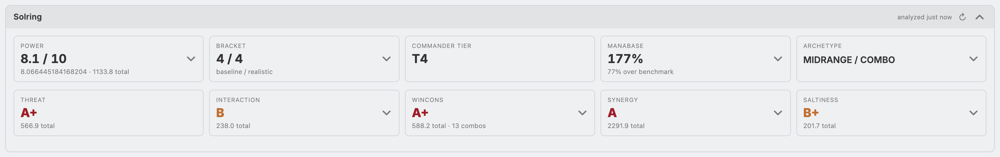

# Solring - Stats for Moxfield



Solring is an extension for Chromium-based browsers that injects [CommanderSalt](https://commandersalt.com)
deck and card metrics into [Moxfield](https://moxfield.com). It shows you power level, bracket, saltiness, archetype, and
per-card stats for your decks, as well as the decks of other users.

## Features

### Deck page (`moxfield.com/decks/…`)

A report card is added below the deck header, most of the tiles expand an inline detail panel.
The features are designed to be easily readable either using a ranking (A-D), raw scores, or a mix of both.

Card names at all panels (such as e.g. synergy) are hoverable, so you can easily get the context of the related cards.

Each card can be annotated. Use the **"Advanced"** menu to customize the view to add **Power**, **Saltiness** and 
**Synergy** columns (color thresholds can be customized in the extension Options panel). **Tags** can also be toggled
on.

In addition to card metrics columns, you can also find per-card metrics in the card sidebar below the card image.

### Deck-List pages (user profile + personal manager)

Solring adds sortable CommanderSalt **metric columns** to the deck table, such as Commander tier,
Power, Bracket, Manabase, Threat, Saltiness, Interaction, Wincons, Combos, Synergy, and Archetype.

You can update the statistics using the **Stats** button next to Moxfield's Sort to *Fetch all*, *Fetch uncached*, or
*Recalculate all* (forces a fresh analysis instead of using cached data).

Requests are only sent to `api.commandersalt.com`, which might be expanded in the future with an EDHRec integration.

You can also customize which columns are shown using the **Columns** button (kinda obvious ^^).

### Elsewhere

**CommanderSalt** offers even more metrics, both in their website and their API.
Solring focuses on the most popular ones, but if you want to see more, you can always open the full analysis on
CommanderSalt by clicking the **"CS"** buttons/links.

## Options

The extension's [options page](chrome-extension://odjkckchpflbblnnngjmapjdmdfcihfb/options.html).

Here you can customize the cache lifetime, color thresholds for the card metrics (Power, Saltiness, Synergy) as well as 
panel display toggles.

## Installation

### Chrome Web Store
You can download the extension directly from the [Chrome Web Store](https://chromewebstore.google.com/detail/kecdkhbccfanhnilmpfhhnflmmafpbhc).

### Manual (load unpacked)

1. Navigate to `chrome://extensions`
2. Enable **Developer mode** (top right)
3. **Load unpacked** → select this folder
4. Open any Moxfield deck / decklistto find the integration

## Development

```sh
npm test   # node --test, pure-logic unit tests (extract, ratings, md5, …)
```

Pure ES modules, no bundler. The metric extraction, rating ladder, MD5, deck-list
engine, and Moxfield URL parsing are unit-tested with `node:test` against JSON
fixtures in `fixtures/`; the DOM-rendering modules are validated in a real browser.

## Building & releasing

```sh
npm run build   # runs tests, then writes dist/solring-v<version>.zip
```

**git tags** are used to trigger the Gitlab action [`.github/workflows/release.yml`](.github/workflows/release.yml), 
which tests, packages the zip with the tag's version, and attaches it to a GitHub Release.

```sh
git tag v1.2.3 && git push origin v1.2.3   # builds solring-v1.2.3.zip, creates the release
```

## Licenses

[AGPL v3](LICENSE)

The Solring icon is derived from [Brush PNGs by Vecteezy](https://www.vecteezy.com/free-png/brush), to be exact [here](https://www.vecteezy.com/png/21975762-colored-grunge-circle-brush-ink-frame).

This is an unofficial fan project, and neither affiliated nor endorsed, sponsored, or specifically approved by Wizards
of the Coast LLC, Moxfield, CommanderSalt nor any other company/provider. It may use the trademarks and other
intellectual property of Wizards of the Coast LLC, which is permitted under Wizards' Fan Site Policy. MAGIC: THE
GATHERING® is a trademark of Wizards of the Coast. For more information about Wizards of the Coast or any of Wizards'
trademarks or other intellectual property, please visit their website at https://company.wizards.com/.

